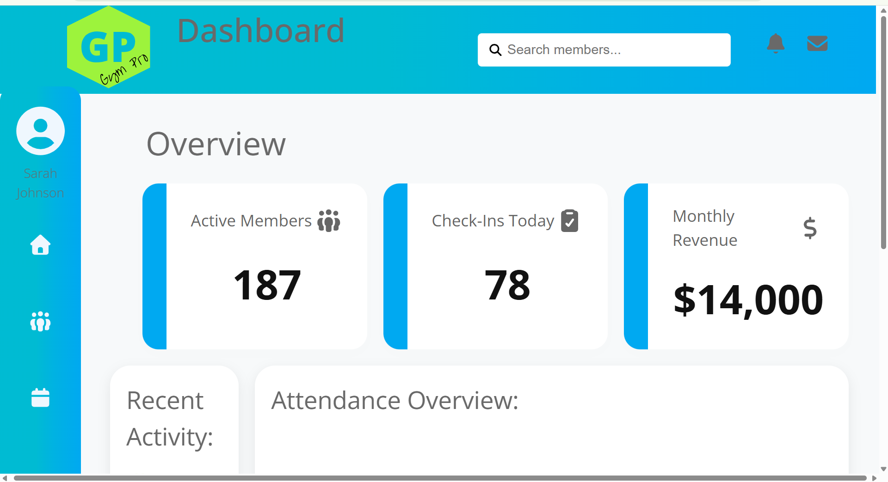
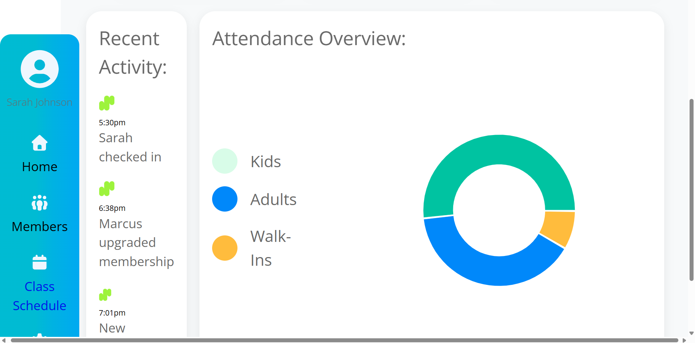
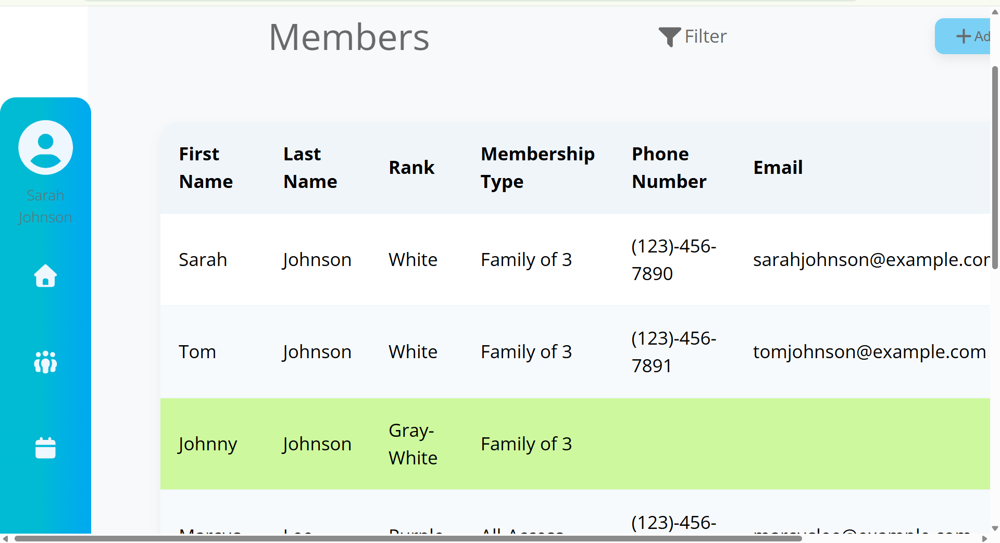
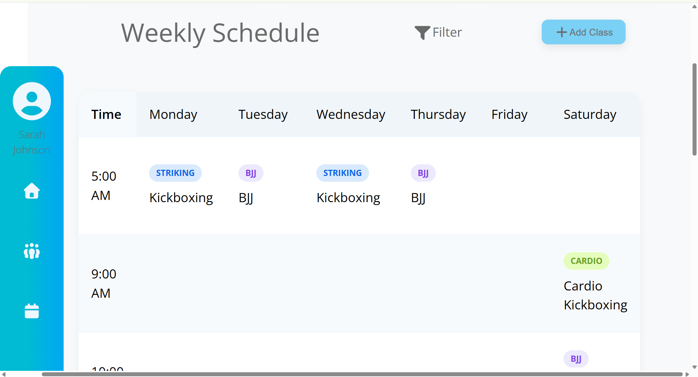
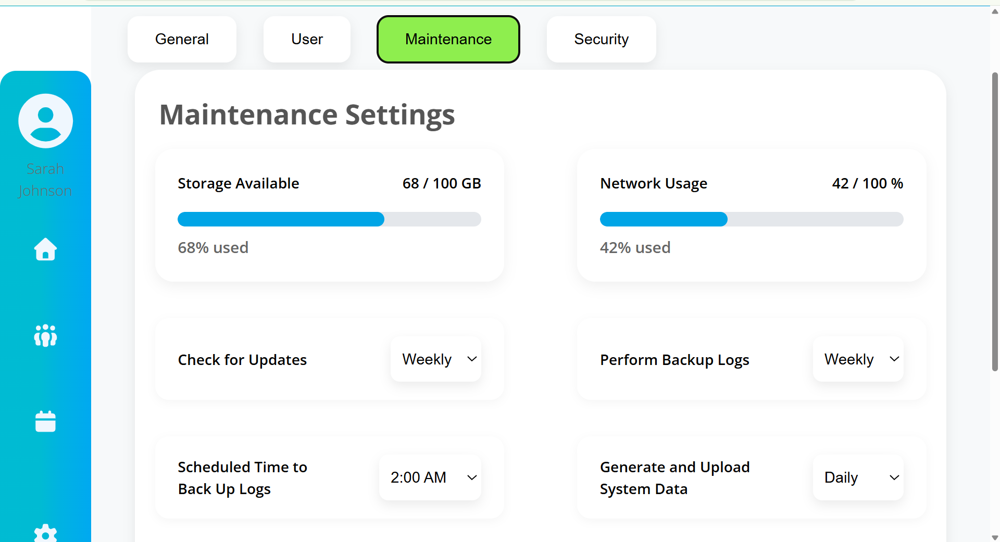

# Gym Dashboard

This is an administrative dashboard designed for martial arts academies and fitness centers built with React. This application provides gym owners and staff with a centralized platform for managing memberships, monitoring attendance and rankings of members, organizing class schedules, and tracking key business metrics. 

## Live Demo

[View Live Demo](https://kgreen33112.github.io/gym-dashboard/)
## Screenshots

### Home

This dashboard overview provides quick access to key business metrics, including active memberships, daily check-in activity, monthly revenue, attendance trends, and recent member activity.   

### Members

View and manage member information, including contact details, membership plans and status, and rank progression. 

### Calendar

Visualization of weekly scheduling for organizing classes, filtering events, and managing gym programming. Visual attendance reporting with breakdowns of adults, kids, and walk-in visitors also provides attendance analytics for the gym administration. 

### Settings

Area of administrative settting options with multiple tabs corresponding to different setting categories.

## Features

### Dashboard Analytics
- Active member tracking
- Daily attendance monitoring
- Monthly revenue overview
- Recent activity feed
- Attendance visualization charts

### Member Management
- Member directory
- Membership type tracking
- Contact information management
- Rank progression display
- Family membership support

### Class Scheduling
- Weekly schedule calendar
- Class categorization
- Schedule filtering
- Class creation workflow

### Settings & Administration

The platform includes a comprehensive settings system designed to provide administrators with cocntrol over user accounts, security, maintenance schedules, and system operations. 

Features include:
- User account management
- Security configuration tools
- Password and credential management
- Automated backup scheduling
- System maintenance scheduling
- Storage utilization monitoring
- Network usage monitoring
- Operational automation settings
- Platform configuration controls
- Administrative preference management

## Built With

- React
- JavaScript(ES6+)
- CSS
- React Icons
- Recharts

## Design Goals

This project was created to simulate a real-world gym management platform similar to other fitness management systems. The primary goals were: 
- Build a multi-page React applicatoin
- Practice component-based architecture
- Implement dashboard-style data visualization
- Create reusable UI components
- Design a clean administrative interface
- Improve state management and application structure

## Future Improvements
- Backend integration
- Authentication and role-based permissions
- Real member database
- Attendance check-in system
- Payment processing
- Membership billing automation
- Email and SMS notifications
- Document template and communication automations
- Mobile-responsive redesign
- Advanced reporting and analytics

## Data Disclaimer

This project currently uses mock data to simulate gym operations, member records, attendance tracking, schedules, and business analytics. The focus of this project was frontend application development, dashboard design, component architecture, and user experience. Future versions of this application will integrate a backend database and authentication system to support real-time gym management workflows. 
